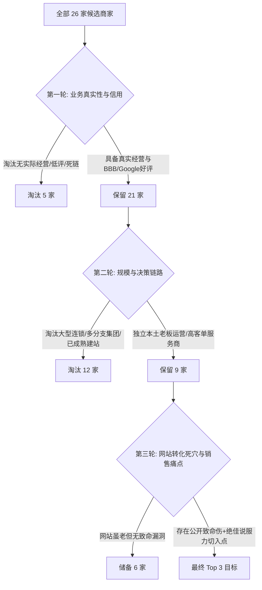

# Local Business Outreach & Lead Evaluation Summary

## 1. 目标细分市场与地理区域选择逻辑

### 为什么选择德克萨斯州达拉斯-沃斯堡大都会区 (Dallas-Fort Worth Metroplex, DFW)？
1. **人口与住房存量巨大**：DFW 拥有超过 780 万人口，是全美增长最快的大都会区之一，郊区独栋别墅与高自住房比率极高。
2. **极端气候创造刚性、高客单价服务需求**：
   - **冰雹与强风暴频发**：屋顶更换（Roofing Replacement）是刚需且高度依赖风暴后的保险理赔，单笔客单价高达 **$8,000 - $25,000+**。
   - **暴风雨与大树折断**：德州高大橡树（Live Oak）、榆树在风暴中倒塌直接威胁屋顶与电线，紧急树木移除客单价达 **$1,500 - $6,000+**。
   - **极端膨胀黏土（Texas Clay Soil）与车库门故障**：地基位移与极端温差导致车库门扭簧断裂（Broken Springs）、轨道变形，属于紧急脱困需求，维修客单价 **$350 - $800**，全套新门更换 **$2,000 - $5,000**。
3. **充沛的商业利润与极高的获客 ROI**：
   对于这些行业的老板而言，**只要一个改进后的新网站每月多帮他们拿下 1-2 单生意，就能轻松收回数千美元的建站与维护成本**。老板有极强的付费意愿和支付能力。

---

## 2. 候选商家评估与筛选框架 (The 5-Pillar Matrix)

我们通过公开渠道（Google Maps, Better Business Bureau, 行业目录, 搜索引擎）抓取并技术审计了 26 家 DFW 本地商家，运用以下五维框架进行漏斗式筛选：

### 核心淘汰原因分类：
1. **企业过大 / 营销团队已成熟（如 Lon Smith, Tarrant Roofing, Texas Tree Surgeons）**：
   - 这些公司年营业额数千万美元，拥有全职营销总监、代理商或复杂多页 WordPress/HubSpot 系统。外包独立开发者很难直接触达决策老板，销售周期过长，不符合 MVP 快速验证要求。
2. **技术故障 / 域名解析异常（如 Chandler Roofing, High Pointe Roofing）**：
   - 网站无法通过 SSL 握手或服务器无响应，可能处于休眠、被黑或重组状态，触达风险大。
3. **缺乏紧迫商业痛点（如 3:16 Roofing, Old Pro Roofing）**：
   - 网站尚可正常展示，虽然视觉一般，但没有明显的公共错误或转化致命伤，冷启动沟通缺乏“一针见血”的切入话题。

---

## 3. 最终选定的 Top 3 商家深度分析

| 排名 | 目标商家 | 行业分类 | 核心优势 | 现有网站致命伤 | 预期商业价值 |
| :---: | :--- | :--- | :--- | :--- | :--- |
| 🥇 | **Good Roots Roofing & Construction** | 屋顶及外墙风暴修复 | BBB 认证 A 级，服务全 DFW，高客单理赔业务 | **GoDaddy 模板灾难**：源码与前端疯狂重复品牌名 9 次、Slogan 8 次；零报价表单；项目图片全为 1x1 占位空白 | 极其震撼的对比效果。单笔屋顶修复 \$9k-\$20k，只要提供专业估价器与风暴应急页面，老板能瞬间看懂价值。 |
| 🥈 | **A. Matt Tree Service** | 应急砍树/专业树艺师 | 20+ 年本地家族运营，4.9★好评(99+条)，重型设备全套 | **停留在 2013 年的 WordPress**：醒目挂着“Comments are closed”博客残留；得州大热天赫然写着“Firewood & Snow Plowing”；无手机端一键呼叫与照片估价 | 真实客户口碑极佳（客户实名夸赞老板 Allen 和 Daniel 队长），但网站严重稀释专业度。改版后直击 24/7 风暴抢修与照片估价。 |
| 🥉 | **DAPco Garage Door Service** | 车库门应急维修与安装 | 15+ 年资深，5.0★ Google好评，24/7 紧急调度 | **公开尴尬故障**：顶部导航 Reviews 链接点击直接 404；首页嵌入报错的 Facebook OAuth 错误代码；H1 标头直接是一串电话号码 | 车库门是绝对的“手机端冲动型/紧急型需求”。修复 404 信任危机，上线 60 分钟极速应急调度与故障自诊工具，能让转化率翻倍。 |

---

## 4. 结论与下一步落地策略

这 3 家商家均满足：
- **老板能直接做决策**（真实家族或独立主理人，非层层外包的大集团）
- **有扎实的线下服务能力与优质口碑**（实打实的好评与 BBB 评级）
- **现有网站与真实实力严重脱节**（存在截屏即可证明的致命硬伤）
- **高客单价/高频刚需**（屋顶、砍树、车库门维修）

我们将针对这 3 家商家展开深度商业画像研究，并为每一家量身定制现代高转化率的专属 Demo。
